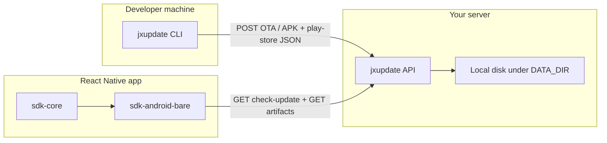

# jxupdate — Complete documentation

This document reflects the **current codebase**. Last aligned with the repository layout: monorepo (`pnpm` + Turborepo), packages under `packages/`, server under `apps/server/`.

---

## 1. Introduction

### What is this project?

**jxupdate** is a **self-hosted update system for React Native (Android-focused in this repo)**. It lets you:

- **Publish** a zipped JavaScript bundle (and assets), **APKs**, and **Play Store metadata** from your machine using the **CLI**.
- **Host** those artifacts on a small **Node.js server** you control.
- **Download, verify, unzip, and stage** JS updates in the app using the **SDK**, with optional **APK sideload** and **Play Store redirect**, and a **rollback** path for OTA if an update never “confirms” as healthy.

### What problem does it solve?

You want **over-the-air (OTA) JavaScript updates** without relying on a third-party service, with **SHA-256 integrity** and a **multi-app** server.

### Key features (as implemented today)

| Feature | Status |
|--------|--------|
| OTA (zip upload, check, download, SHA-256, local storage) | **Implemented** |
| APK upload, check, download, SHA-256, install hook | **Implemented** |
| Play Store metadata (`latestVersionName` + URL) and client redirect | **Implemented** |
| Checksum validation (CLI → server; app → disk file) | **Implemented** |
| Rollback (pending OTA + bootstrap) | **Implemented** (see §11) |
| Update priority in app: **APK > OTA > Play Store** | **Implemented** (`resolvePriorityUpdate` + `applyRecommendedUpdate`) |

### When to use it

- You run your own server (Docker or Node).
- You are OK integrating **Android** pieces (`react-native-fs`, `react-native-zip-archive`) and **wiring the app to load the bundle from disk** (this repo stages files; **loading the bundle is your app’s responsibility**).
- For **APK installs**, you provide an **`installApk` callback** (e.g. intent + `FileProvider`)—the SDK downloads and verifies the file, then hands you the path.

---

## 2. System overview

Three parts work together:



| Component | Package / path | Role |
|-----------|----------------|------|
| **CLI** | `packages/cli` | `ota publish`, `apk publish`, `play-store set`; SHA-256 + upload. |
| **Server** | `apps/server` | Fastify: OTA + APK + Play Store config; `check-update` merges all channels. |
| **Protocol** | `packages/protocol` | Shared types and Zod schemas for API shapes. |
| **SDK core** | `packages/sdk-core` | `check-update`, **`resolvePriorityUpdate`** (APK > OTA > Play Store), rollback **types**. |
| **Android adapter** | `packages/sdk-android-bare` | `applyRecommendedUpdate`, OTA path, **`installApk`**, Play Store `Linking.openURL`. |

### Data flow (check-update + priority, step by step)

1. **Developer** may publish **OTA** (`jxupdate ota publish`), **APK** (`jxupdate apk publish`), and/or **Play Store** metadata (`jxupdate play-store set`).
2. **Server** stores artifacts under `DATA_DIR/apps/{appId}/…` and answers **`GET /v1/apps/:appId/check-update`** with **zero or more** of: `apk`, `ota`, `playStore` (each optional when `status` is `update_available`).
3. **App** calls `check-update` with `nativeBuild` (Android **versionCode**), `channel`, optional `currentOtaVersion`, optional **`currentVersionName`** (for Play Store comparison), and header **`x-jx-check-key`**.
4. **Client priority:** **`APK` > `OTA` > `Play Store`** (`resolvePriorityUpdate` in `packages/sdk-core/src/priority.ts`). Use **`applyRecommendedUpdate`** on Android to follow this automatically, or inspect the payload yourself.
5. **OTA branch:** same as before—download zip, verify, unzip, **reload**, **`markOtaHealthy()`**, **`bootstrap()`** rollback if needed.
6. **APK branch:** download `.apk` to temp, verify SHA-256, call your **`installApk(apkPath)`** implementation.
7. **Play Store branch:** open listing URL (default **`Linking.openURL`**).

---

## 3. Features

### OTA updates

- **CLI:** directory → zip → SHA-256 → upload.
- **Server:** stores zip per `appId` / `channel` / `updateId` (ULID), tracks **latest** manifest per channel.
- **Client:** `check-update` → download → **SHA-256** match → unzip → staged dirs under `storageRoot/jxupdate/`.

### APK update system

- **CLI:** `jxupdate apk publish <file.apk> --version-code N --version-name X.Y.Z` → SHA-256 → `POST /v1/apps/:appId/apk` (multipart field **`apk`**).
- **Server:** stores under `apps/{appId}/apk/files/{versionCode}/app.apk`, **`current.json`** points at latest upload.
- **check-update:** includes **`apk`** when server `versionCode` **>** client `nativeBuild`.
- **Client:** `GET /v1/apps/:appId/apk/files/:versionCode/app.apk` with `x-jx-check-key`; then **`installApk`** (you implement install UI / intent).

### Play Store update alert

- **CLI:** `jxupdate play-store set --latest-version … --url …` → `POST /v1/apps/:appId/play-store` (JSON body).
- **Server:** persists `latestVersionName` + `playStoreUrl` per app.
- **check-update:** includes **`playStore`** only if the client sends **`currentVersionName`** and server `latestVersionName` is **newer** (semver when possible).
- **Client:** opens **`playStoreUrl`** (browser or Play Store)—no forced in-app modal in this package; show UI in your app if you want.

### Checksum validation

- **CLI:** SHA-256 of the zip **before** upload; server recomputes and rejects mismatch (`apps/server/src/routes.ts`).
- **App:** `RNFS.hash(file, 'sha256')` compared to manifest (`packages/sdk-android-bare/src/coordinator.ts`).

### Rollback system

- State machine in `packages/sdk-core/src/rollback.ts`: `idle` vs `pending_commit`.
- **Not** OS crash analytics: rollback runs if **`bootstrap()`** sees `pending_commit` because **`markOtaHealthy()`** never ran (e.g. crash or bad launch). See §11 for **bootstrap vs reload** ordering.

---

## 4. Project structure

```
jxupdate/
  apps/
    server/                 # Fastify HTTP API
  packages/
    cli/                      # jxupdate CLI
    protocol/                 # Shared Zod schemas + constants
    sdk-core/                 # fetch client, verify helpers, rollback types
    sdk-android-bare/         # Android RN coordinator (FS + unzip)
  docker/
    Dockerfile                # Server image
    docker-compose.yml
    apps-config.example.json
  package.json                # Monorepo root (pnpm + turbo)
  pnpm-workspace.yaml
  turbo.json
```

| Path | Purpose |
|------|---------|
| `apps/server/src/index.ts` | Loads config, registers multipart, `/healthz`, starts Fastify. |
| `apps/server/src/routes.ts` | `check-update`, OTA + APK download, `POST /ota`, `POST /apk`, `POST /play-store`. |
| `apps/server/src/check-update-logic.ts` | Merge APK / OTA / Play Store offers. |
| `apps/server/src/apk-storage.ts` | APK manifests and paths. |
| `apps/server/src/play-store-storage.ts` | Play Store JSON config. |
| `apps/server/src/config.ts` | Paths for config file, data dir, public URL, port. |
| `apps/server/src/ota-storage.ts` | Filesystem layout, manifest index, hashing uploaded file. |
| `packages/cli/src/cli.ts` | Commander CLI: `jxupdate ota publish`. |
| `packages/cli/src/zip.ts` | archiver zip + SHA-256 file. |
| `packages/cli/src/upload.ts` | OTA multipart upload. |
| `packages/cli/src/apk-upload.ts` | APK multipart upload. |
| `packages/cli/src/play-store-set.ts` | JSON POST for Play Store config. |
| `packages/sdk-core/src/client.ts` | `JxUpdateClient.checkUpdate`. |
| `packages/sdk-android-bare/src/coordinator.ts` | Main integration class. |

---

## 5. Prerequisites

- **Node.js:** **22.x** matches `docker/Dockerfile` (Node 22 Alpine). Local dev: **18+** with `fetch` (CLI upload uses global `fetch`).
- **Package manager:** **pnpm 9** (see root `package.json` `packageManager`).
- **React Native app (Android):**
  - `react`, `react-native` (peer range in `packages/sdk-android-bare/package.json`).
  - **`react-native-fs`**, **`react-native-zip-archive`** (peer dependencies).
- **Android:** `INTERNET`; for APK sideload, user/device must allow **install from unknown sources** / per-app install permission—**your `installApk` implementation** must match Play policy and OEM rules.
- **Server config file:** JSON at `JXUPDATE_APPS_CONFIG` (see §7).

---

## 6. Installation (step by step)

### Backend (server)

1. Clone the repo and install from root:

```bash
cd jxupdate
pnpm install
pnpm exec turbo run build --filter=@jxupdate/protocol --filter=@jxupdate/server
```

2. Create **`apps-config.json`** (see `docker/apps-config.example.json`):

```json
{
  "apps": [
    {
      "appId": "my-app",
      "publishSecret": "long-random-publish-secret",
      "checkSecret": "long-random-check-secret"
    }
  ]
}
```

3. Set env and run:

```bash
export JXUPDATE_APPS_CONFIG="/absolute/path/to/apps-config.json"
export JXUPDATE_DATA_DIR="/absolute/path/to/data"
export JXUPDATE_PUBLIC_BASE_URL="http://127.0.0.1:8787"
export PORT=8787
node apps/server/dist/index.js
```

4. Verify:

```bash
curl -sS http://127.0.0.1:8787/healthz
```

Expected: `{"ok":true}` (you may also see Fastify logger lines in the terminal).

### CLI

From monorepo root after build:

```bash
pnpm --filter @jxupdate/cli build
pnpm --filter @jxupdate/cli exec jxupdate --help
pnpm --filter @jxupdate/cli exec jxupdate ota --help
pnpm --filter @jxupdate/cli exec jxupdate apk --help
pnpm --filter @jxupdate/cli exec jxupdate play-store --help
```

Or `pnpm link` / publish `@jxupdate/cli` for global `jxupdate` on PATH.

### SDK (React Native)

1. Add workspace packages (yarn/pnpm in your app monorepo) or `npm pack` / private registry for:

   - `@jxupdate/protocol`
   - `@jxupdate/sdk-core`
   - `@jxupdate/sdk-android-bare`

2. Install peers in the **app**:

```bash
yarn add react-native-fs react-native-zip-archive
```

3. **Autolinking** (RN 0.60+): run Android build; run `pod install` only if you add iOS later.

4. **No native “link” CLI** is required beyond normal autolink for those libs.

5. **Config in app:** pass `baseUrl`, `appId`, `checkSecret`, `storageRoot` (e.g. `RNFS.DocumentDirectoryPath`), `reloadApp`, and **`installApk`** if you use APK updates (see §9).

---

## 7. Configuration

### API base URL

- Must match what devices can reach (LAN IP, domain, HTTPS behind proxy).
- Server builds **download URLs** from **`JXUPDATE_PUBLIC_BASE_URL`** (trailing slash stripped in `apps/server/src/config.ts`).

### API keys (per app)

| Secret | Used on | Header / method |
|--------|---------|------------------|
| **publishSecret** | CLI upload | `Authorization: Bearer <publishSecret>` (`packages/cli/src/upload.ts`) or `x-jx-publish-key` (`apps/server/src/auth.ts`) |
| **checkSecret** | App | `x-jx-check-key: <checkSecret>` (`packages/protocol/src/headers.ts`) |

**Warning:** embedding `checkSecret` in the app is convenient but **not** secret from a determined attacker; treat as **obfuscation**, not DRM.

### Versioning

- **`nativeBuild` (query):** treated as Android **`versionCode`**. Used for: (1) OTA **`minNativeBuild`** gate, (2) **APK** offer when server APK `versionCode` **>** `nativeBuild`.
- **`otaVersion`:** semver compared for OTA (`semver` in `apps/server/src/check-update-logic.ts`).
- **`currentVersionName` (query, optional):** must be sent for **Play Store** offers; compared to stored **`latestVersionName`**.
- **`channel`:** string (default `production`); OTA tracks per channel.
- **`runtimeVersion`:** OTA metadata for your pipeline.
- **`updateId`:** ULID per OTA upload; APK uses **`versionCode`** as stable id in URLs.

---

## 8. How it works

### OTA flow (Developer → CLI → Server → App)

1. You build a JS bundle output folder (Metro output or your pipeline).
2. CLI zips it, hashes it, uploads fields + file `bundle`.
3. Server verifies hash, writes files under `DATA_DIR/apps/...`.
4. App calls `GET /v1/apps/:appId/check-update?nativeBuild=…&channel=…&currentOtaVersion=…&currentVersionName=…` with `x-jx-check-key`.
5. If anything applies, `status` is `update_available` and the response may include **`apk`**, **`ota`**, and/or **`playStore`** (each optional).
6. Client applies **APK > OTA > Play Store** (`resolvePriorityUpdate`).

**Sample `check-update` response (multiple offers possible):**

```json
{
  "status": "update_available",
  "apk": {
    "downloadUrl": "http://localhost:8787/v1/apps/my-app/apk/files/42/app.apk",
    "manifest": {
      "appId": "my-app",
      "versionCode": 42,
      "versionName": "2.1.0",
      "sha256": "abcdef0123456789abcdef0123456789abcdef0123456789abcdef0123456789",
      "sizeBytes": 9000000,
      "createdAt": "2026-04-19T12:00:00.000Z",
      "bundleRelativePath": "apps/my-app/apk/files/42/app.apk"
    }
  },
  "ota": {
    "downloadUrl": "http://localhost:8787/v1/apps/my-app/ota/files/01JXXXX/bundle.zip",
    "manifest": {
      "updateId": "01JXXXX",
      "appId": "my-app",
      "channel": "production",
      "otaVersion": "1.2.0",
      "runtimeVersion": "0.76.0",
      "minNativeBuild": 10,
      "sha256": "abcdef0123456789abcdef0123456789abcdef0123456789abcdef0123456789",
      "sizeBytes": 123456,
      "createdAt": "2026-04-19T12:00:00.000Z",
      "bundleRelativePath": "apps/my-app/ota/production/01JXXXX/bundle.zip"
    }
  },
  "playStore": {
    "latestVersionName": "2.2.0",
    "playStoreUrl": "https://play.google.com/store/apps/details?id=com.example.app"
  }
}
```

**Sample `no_update`:**

```json
{ "status": "no_update" }
```

**Upload success (201):**

```json
{
  "ok": true,
  "manifest": { }
}
```

(`manifest` matches the server’s `OtaManifest` shape.)

### APK flow (upload → detect → download → install)

1. **Upload:** `jxupdate apk publish ./release.apk --version-code 42 --version-name 2.1.0` (must match the real APK’s **`versionCode`** / **`versionName`**).
2. **Detect:** `check-update` includes `apk` when server **`versionCode` > `nativeBuild`** query param.
3. **Download:** same **`x-jx-check-key`** as other artifacts.
4. **Install:** not automatic—implement **`installApk`** on the coordinator (intent + `FileProvider`, or your policy-compliant installer).

### Play Store flow (configure → compare → open)

1. **Configure:** `jxupdate play-store set --latest-version 2.2.0 --url "https://play.google.com/..."`.
2. **Compare:** server includes `playStore` only when **`currentVersionName`** is present and **`latestVersionName`** is newer.
3. **Open:** `applyRecommendedUpdate` uses **`Linking.openURL(playStoreUrl)`** unless you pass **`openPlayStoreUrl`**.

---

## 9. Usage guide

### Push an OTA update

1. **Prepare a folder** containing the bundle and assets you want in the zip (whatever your RN pipeline outputs).

2. **Set environment** (or use flags):

```bash
export JXUPDATE_BASE_URL="http://YOUR_SERVER:8787"
export JXUPDATE_APP_ID="my-app"
export JXUPDATE_PUBLISH_SECRET="your-publish-secret"
```

3. **Run:**

```bash
pnpm --filter @jxupdate/cli exec jxupdate ota publish /path/to/bundle-folder \
  --ota-version 1.2.0 \
  --runtime-version 0.76.0 \
  --min-native-build 10 \
  --channel production
```

4. **What happens internally**

- Temp zip → SHA-256 → multipart POST with fields `channel`, `otaVersion`, `runtimeVersion`, `minNativeBuild`, `sha256`, file `bundle`.
- Server streams upload to disk, hashes file, compares to posted `sha256`, saves manifest, updates channel current.

5. **Verify**

- CLI prints JSON with `ok: true` and `manifest`.
- Or call check-update manually:

```bash
curl -sS -H "x-jx-check-key: YOUR_CHECK_SECRET" \
  "http://YOUR_SERVER:8787/v1/apps/my-app/check-update?nativeBuild=10&channel=production"
```

### Upload APK

```bash
pnpm --filter @jxupdate/cli exec jxupdate apk publish /path/to/app-release.apk \
  --version-code 42 \
  --version-name 2.1.0
```

**Expected in app:** when `check-update` returns `apk` and you use **`applyRecommendedUpdate`**, the APK is downloaded to `…/jxupdate/tmp/download.apk`, verified, then **`installApk(path)`** runs. You must handle OS install permission UX.

### Play Store metadata

```bash
pnpm --filter @jxupdate/cli exec jxupdate play-store set \
  --latest-version 2.2.0 \
  --url "https://play.google.com/store/apps/details?id=com.example.app"
```

**Expected in app:** if `playStore` wins priority (no newer APK/OTA), **`Linking.openURL`** opens the listing. Show an in-app alert **before** calling `applyRecommendedUpdate` if you want a confirmation dialog.

---

## 10. SDK behavior

### When does the update check happen?

**Whenever your code calls it.** There is **no** automatic timer or AppState listener in this repo. Typical pattern:

- Call `applyOtaIfAvailable(...)` after app start and/or when returning to foreground (you wire `AppState` yourself).

### Priority: APK > OTA > Play Store

Implemented in **`resolvePriorityUpdate`** (`packages/sdk-core/src/priority.ts`). On Android, **`applyRecommendedUpdate`** performs one action per call following that order. Use **`applyOtaIfAvailable`** only if you want OTA **without** considering APK/Play Store in the same check.

### Retry behavior

**Not implemented** in the coordinator (no exponential backoff / resume). Network errors throw; you catch and retry in app code.

### Failure handling

- **check-update** failure: `JxUpdateClient` throws with HTTP body text.
- **Download** non-2xx: coordinator throws `jxupdate: download failed with HTTP ...`.
- **SHA-256 mismatch:** throws; temp zip unlinked where applicable.

---

## 11. Rollback system

### How “crash detection” works

The code does **not** integrate with Android crash reporting. It uses **persistent state**:

- After a successful download/unzip, state is **`pending_commit`** until **`markOtaHealthy()`** runs (`packages/sdk-android-bare/src/coordinator.ts`).
- **`bootstrap()`** runs at startup: if state is **`pending_commit`**, it **deletes the current bundle directory** and restores the **pointer** to the **previous** bundle (`rollbackPointer`).

### Why it matters

If the new JS bundle crashes before `markOtaHealthy()`, the next cold start can restore the **previous** staged bundle (if any).

### Integration caveat (important)

`bootstrap()` treats **any** `pending_commit` as rollback on cold start. **`applyOtaIfAvailable`** sets `pending_commit` and then calls **`reloadApp()`**. On the new JS context, if **`bootstrap()`** runs **before** `markOtaHealthy()` clears state, the new bundle may be removed. **Validate call order** for your entry point; you may need to call `markOtaHealthy()` very early after a reload, or adjust the SDK—verify behavior when integrating.

---

## 12. Hosting guide

### Local

Use `127.0.0.1` only for emulator/device on same machine; use **LAN IP** in `JXUPDATE_PUBLIC_BASE_URL` for physical devices.

### VPS (Docker)

From repo root:

```bash
docker compose -f docker/docker-compose.yml up --build
```

- Binds port **8787** (override with `JXUPDATE_PORT`).
- Mounts **`docker/apps-config.example.json`** → `/data/apps-config.json` (replace with your real file in production).
- Persistent volume **`jxupdate_data`** for `/data` artifact storage.

**Production:** put **HTTPS** (Caddy/nginx) in front; set **`JXUPDATE_PUBLIC_BASE_URL`** to `https://your-domain` so clients get correct download URLs.

### File storage

All artifacts live under **`JXUPDATE_DATA_DIR`** (default `./data`). Layout includes `apps/<appId>/ota/<channel>/...`, `manifests/<updateId>.json`, and `current.json` per channel.

### Production considerations

- **Back up** the data directory.
- **TLS** at the edge.
- **Secrets:** rotate `publishSecret` / `checkSecret`; restrict who can reach upload routes (firewall/VPN if needed).
- **Multipart limit:** 512 MiB per upload (`apps/server/src/index.ts`).

---

## 13. Environment variables

### Server

| Variable | Default | Meaning |
|----------|---------|---------|
| `JXUPDATE_APPS_CONFIG` | `$JXUPDATE_DATA_DIR/apps-config.json` | Absolute path to JSON config with `apps[]`. |
| `JXUPDATE_DATA_DIR` | `./data` (resolved) | Root for stored zips and indexes. |
| `JXUPDATE_PUBLIC_BASE_URL` | `http://localhost:8787` | Base for absolute `downloadUrl` in `check-update`. Trailing slash trimmed. |
| `PORT` or `JXUPDATE_PORT` | `8787` | Listen port. |

### CLI

| Variable | Meaning |
|----------|---------|
| `JXUPDATE_BASE_URL` | Server URL (used if `--base-url` omitted). |
| `JXUPDATE_APP_ID` | `appId` path segment. |
| `JXUPDATE_PUBLISH_SECRET` | Bearer token for upload. |

### Docker Compose (`docker/docker-compose.yml`)

Sets `PORT`, `JXUPDATE_DATA_DIR`, `JXUPDATE_APPS_CONFIG`, `JXUPDATE_PUBLIC_BASE_URL`, and optional `JXUPDATE_PORT` for host mapping.

---

## 14. Troubleshooting

| Symptom | What to check |
|---------|----------------|
| **OTA not applying** | Device can reach `baseUrl`; `checkSecret` matches server; `nativeBuild` ≥ `minNativeBuild`; semver shows newer `otaVersion`; you still need **native/Metro wiring** to **load JS from `getActiveBundleDir()`**—this repo does not switch Metro by itself. |
| **Checksum mismatch** | Corrupted download; proxy modifying body; wrong file on server—re-upload with CLI. |
| **APK not installing** | Implement **`installApk`**; ensure **`versionCode`** in CLI matches the APK; device allows unknown sources; `FileProvider` / intent flags correct. |
| **Play Store never offered** | Pass **`currentVersionName`** on `check-update`; run **`jxupdate play-store set`**; ensure semver can compare or strings differ. |
| **App not reloading** | Implement `reloadApp` (e.g. `DevSettings.reload()`); ensure it runs after OTA. |
| **Server not responding** | `loadAppsConfig` fails if config file missing—process exits. Check path and JSON. |
| **401 Unauthorized** | Wrong `x-jx-check-key` or Bearer publish secret. |
| **404 Unknown app** | `appId` not in `apps-config.json`. |
| **Update disappears after reload** | See §11 bootstrap / `pending_commit` ordering. |

---

## 15. Best practices

- **Bump `otaVersion`** with semver for every release clients should receive.
- Set **`minNativeBuild`** when the OTA requires new native code; clients below that stay on old JS.
- **Test** on a staging **`channel`** before `production` (same server, different channel string).
- **Do not** ship the **publish** secret in the app—only on CI / developer machines.
- Plan **HTTPS** before production.

---

## 16. FAQ

**Q: Does this replace the Play Store for native APK updates?**
A: **APK sideload** is optional and intended for enterprise / internal distribution. Public consumer apps should still prefer **Play Store** updates; use **`play-store set`** + **`playStore`** branch to deep-link users when a newer store build exists.

**Q: Does the SDK call `check-update` automatically?**
A: No—you call `applyOtaIfAvailable` (or `JxUpdateClient.checkUpdate`) from your code.

**Q: Where is the OTA zip extracted?**
A: Under `storageRoot/jxupdate/bundles/<updateId>/`. Use `getActiveBundleDir()` for the current pointer.

**Q: Is iOS supported?**
A: Not by `sdk-android-bare`. The server and protocol are generic; an iOS adapter would be separate.

**Q: Can I use HTTP?**
A: Development only. Use HTTPS in production; `downloadUrl` must be reachable by the device.

---

## Document history

- Generated for developers integrating **jxupdate** from source; paths are relative to the repository root.
